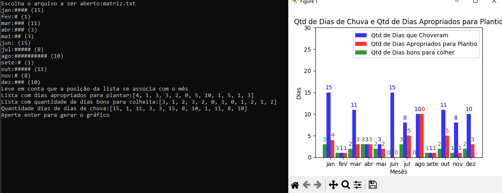

<h2>
  First College Assignment
</h2>

  This was one of the first assignments I completed for the Programming 1 course. Its purpose was to learn how to use file reading, read a matrix, and return how many days it rained in each month and how many days were appropriate for planting.

<h2>
  How does it work?
</h2>

  The given matrix needs to be a 12x30 matrix, with rows representing months and columns representing days. The matrix is composed only of 0s and 1s, where 0 represents sunny days and 1 represents rainy days. A day suitable for planting consists of 1 rainy day followed by two sunny days, and a day suitable for harvesting is made up of 1 rainy day followed by 3 sunny days. For there to be at least one harvest, the month must have at least one planting day first.

<h2>
  Graphs
</h2>

  After the program reads the matrix file, it will return a graph generated directly in the terminal, and another one, generated by the Matplotlib library, after pressing a key. This part of the assignment wasn't mandatory, but for better visualization of the obtained data, I sought to learn how to implement Matplotlib for plotting graphs.

  
  

